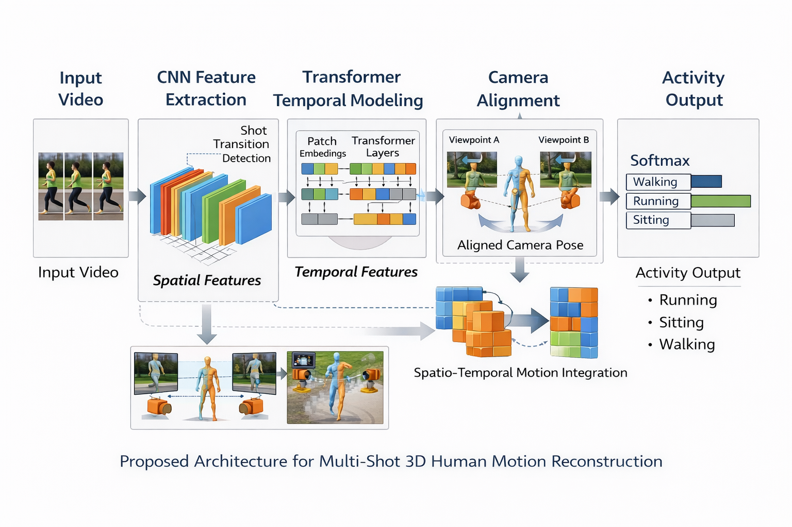

# 🌾 Farmer Connect

A Smart Agricultural Marketplace that connects farmers and buyers with AI-powered pricing, secure negotiation, and transparent transaction workflows.

---

## 📌 Overview

Farmer Connect is a digital marketplace designed to:

- Enable farmers to list crops
- Allow buyers to search and negotiate
- Provide AI-based price prediction
- Support structured bidding
- Maintain secure transaction records
- Handle disputes transparently

The system is built using a microservice-ready architecture with role-based access control and scalable backend design.

---

## 🚀 Features

### 🔐 User Identity & Access Control
- Mobile OTP-based authentication
- Role-Based Access Control (Farmer, Buyer, Admin)
- KYC document verification
- Secure session management (JWT)

### 🌾 Crop Listing & Quality Representation
- Create and manage listings
- Upload crop images
- Capture standardized quality attributes
- Location-aware filtering

### 📊 Pricing Intelligence
- Market price comparison
- Historical price trends
- Demand forecasting
- AI-based price prediction with confidence range

### 🤝 Negotiation & Bidding
- Counter-offer mechanism
- Time-bound auction system
- Offer locking and confirmation
- Complete negotiation history

### 🧾 Transaction & Dispute Handling
- Digital transaction records
- Admin-based dispute resolution
- Audit-ready logs

---

## 🏗 System Architecture

---

## 📐 UML Diagrams

### 📌 Use Case Diagram

### 📌 Class Diagram

### 📌 Activity Diagram

### 📌 Sequence Diagram

---

## 🛠 Tech Stack

| Layer | Technology |
|-------|------------|
| Frontend | Next.js |
| Backend | Node.js (Express) |
| AI Microservice | Python FastAPI |
| Database | PostgreSQL |
| Authentication | JWT + OTP |
| Deployment | Docker / Cloud |

---

## 📂 Project Structure

