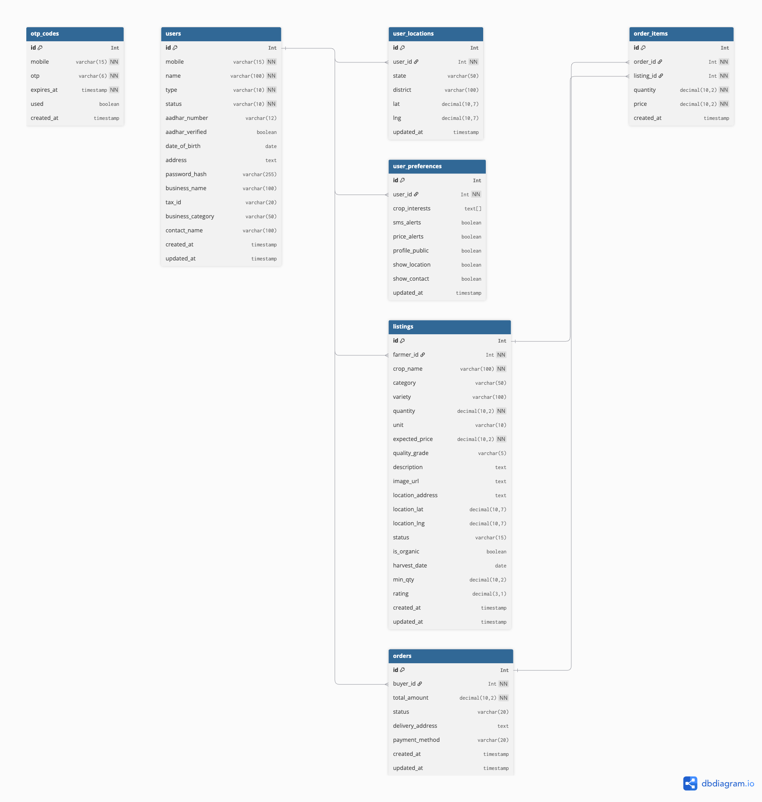
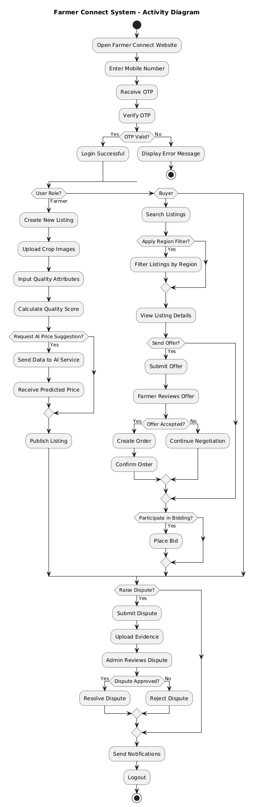
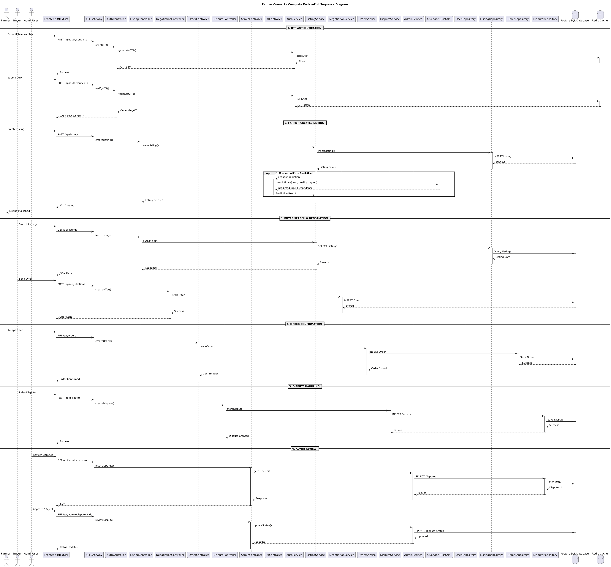
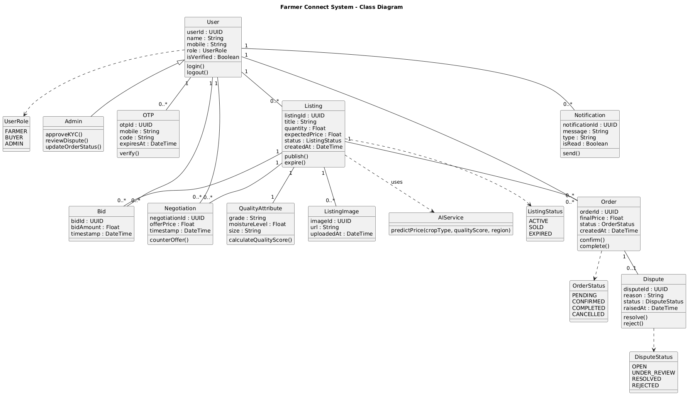

#  Farmer Connect

A Smart Agricultural Marketplace that connects farmers and buyers with AI-powered pricing, structured bidding, secure negotiation, and transparent transaction workflows.

---

##  Overview

Farmer Connect is a digital marketplace platform designed to:

- Enable farmers to list crops
- Allow buyers to search and negotiate
- Provide AI-based price prediction
- Support structured bidding & counter-offers
- Maintain secure transaction records
- Handle disputes transparently
- Enforce Role-Based Access Control (RBAC)

The system follows a scalable full-stack architecture with secure authentication and modular backend services.

---

##  Features

###  User Identity & Access Control
- Mobile OTP-based authentication
- Role-Based Access Control (Farmer, Buyer, Admin)
- KYC verification workflow
- Secure session management (JWT)

###  Crop Listing & Quality Representation
- Create and manage listings
- Upload crop images
- Capture standardized quality attributes
- AI-based price prediction

###  Bidding & Negotiation
- Place bids on listings
- Send offers
- Counter-offer negotiation system
- Structured order confirmation

###  Order Management
- Order lifecycle: Pending → Confirmed → Completed
- Order tracking
- Transaction history

###  Dispute Handling
- Raise disputes
- Admin review & resolution
- Transparent dispute status tracking

### Notification System
- Real-time notifications
- Order updates
- Dispute updates

---

##  System Architecture


---

## 📊 Database Schema



---

##  Use Case Diagram


---

##  Activity Diagram



---

##  Sequence Diagram



---

## Class Diagram



---

##  Tech Stack

### 🔹 Frontend
- React / Vite
- Tailwind CSS
- Axios

### 🔹 Backend
- Node.js
- Express.js
- JWT Authentication
- REST APIs

### 🔹 Database
- SQL (PostgreSQL / MySQL)

### 🔹 AI Microservice
- Python (FastAPI)
- Machine Learning model for price prediction

### 🔹 External Services
- SMS/OTP Service
- Notification Service

---

##  Project Structure
Farmer_Connect/
│
├── backend/
│ ├── controllers/
│ ├── services/
│ ├── routes/
│ ├── models/
│ └── config/
│
├── frontend/
│ ├── components/
│ ├── pages/
│ ├── services/
│ └── assets/
│
├── docs/
│ ├── Architecture diagram.png
│ ├── Schema.png
│ ├── activity.png
│ ├── class.png
│ ├── sequence.png
│ └── use case.png
│
└── README.md

---

##  Role-Based Access Control (RBAC)

| Role   | Permissions |
|--------|------------|
| Farmer | Create listings, manage orders |
| Buyer  | Search listings, place bids, negotiate |
| Admin  | Approve KYC, manage disputes, update orders |

Access restrictions are enforced at both UI and API levels.

---

##  Installation & Setup

### 1️⃣ Clone the Repository

```bash
git clone https://github.com/your-username/Farmer_Connect.git
cd Farmer_Connect

2️⃣ Backend Setup
cd backend
npm install
npm start

3️⃣ Frontend Setup
cd frontend
npm install
npm run dev


 Security Features

OTP-based authentication

JWT-based session management

Input validation & sanitization

Role-based authorization

Secure password handling

Protected API routes

 Future Enhancements

Real-time bidding using WebSockets

Blockchain-based transaction logs

Escrow payment integration

Advanced AI pricing model

Mobile app support

📜 License

This project is licensed under the MIT License.

